# 🔧 RefactorAIOperationsIDE: Bridging AI Intelligence with IDE Refactoring Power

> 🚀 **Open-source solution that transforms AI-generated code suggestions into safe, semantic-aware IDE refactoring operations**

## 📋 Table of Contents

- [🔴 The Problem](#-the-problem)
- [💡 The Solution](#-the-solution)
- [🎯 Key Features](#-key-features)
- [🏗️ Architecture](#️-architecture)
- [🚀 Quick Start](#-quick-start)
- [📊 Refactoring Operations](#-refactoring-operations)
- [🔌 IDE Support](#-ide-support)
- [💼 Use Cases](#-use-cases)
- [📄 License](#-license)


### The Fundamental Flaw: Generative vs Transformative

| Approach | Method | Result | Risk Level |
|----------|--------|--------|------------|
| **🔴 AI Generative** | Creates new code from scratch | Loses all context, breaks dependencies | ⚠️ HIGH |
| **🟡 Text Replacement** | Find & replace strings | Misses semantic meaning | ⚠️ MEDIUM |
| **🟢 IDE Refactoring** | AST transformations | Preserves all relationships | ✅ ZERO |

> **Key Insight**: Current AI assistants GENERATE code instead of TRANSFORMING it, making them fundamentally destructive rather than constructive.

## 💡 The Solution

### RefactorAIOperationsIDE: Non-Destructive, Guaranteed-Safe Transformations

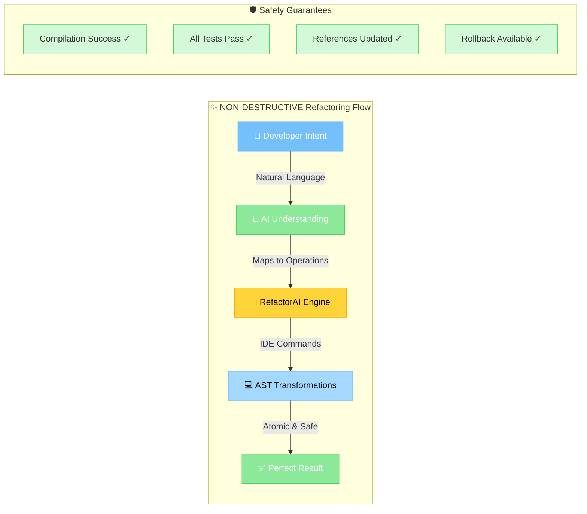

## 🎯 Core Principles

### 1. **Always Working Code** 🟢
Every refactoring operation MUST result in compilable, working code. No exceptions.

### 2. **Non-Destructive Transformations** 🛡️
We TRANSFORM existing code using IDE operations, never GENERATE replacements.

### 3. **Semantic Awareness** 🧠
Every operation understands the code's meaning, not just its text.

### 4. **Atomic & Reversible** ↩️
All operations can be undone with a single command.

### 5. **Cross-File Consistency** 🔗
Updates ALL references across the entire codebase automatically.

## 🔧 Supported Refactoring Operations

### Complete Eclipse JDT Refactoring Mapping

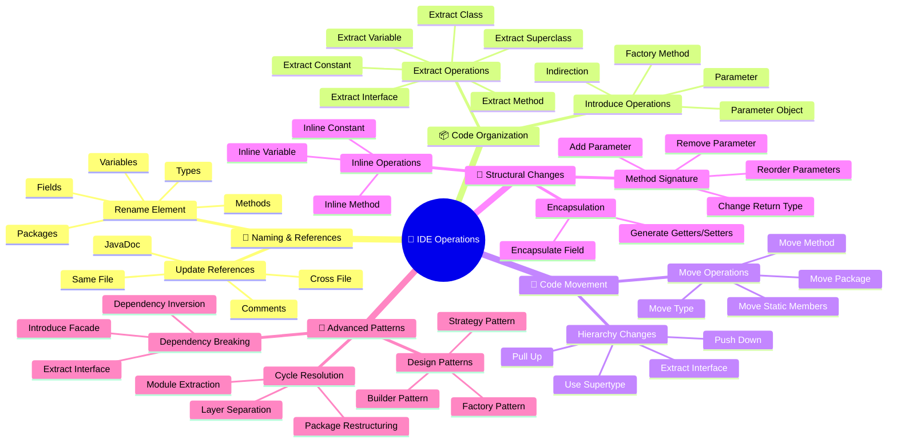

### Refactoring Safety Matrix

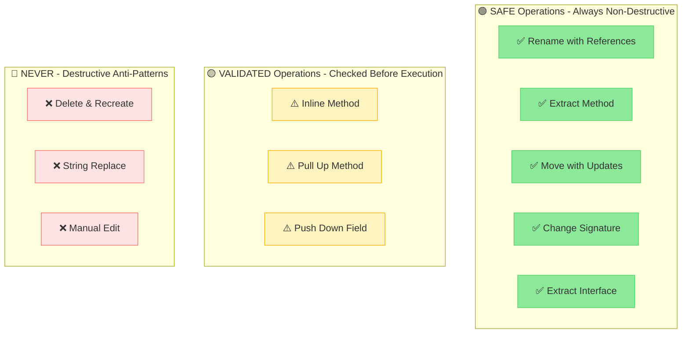

## 🏗️ Architecture

### System Components

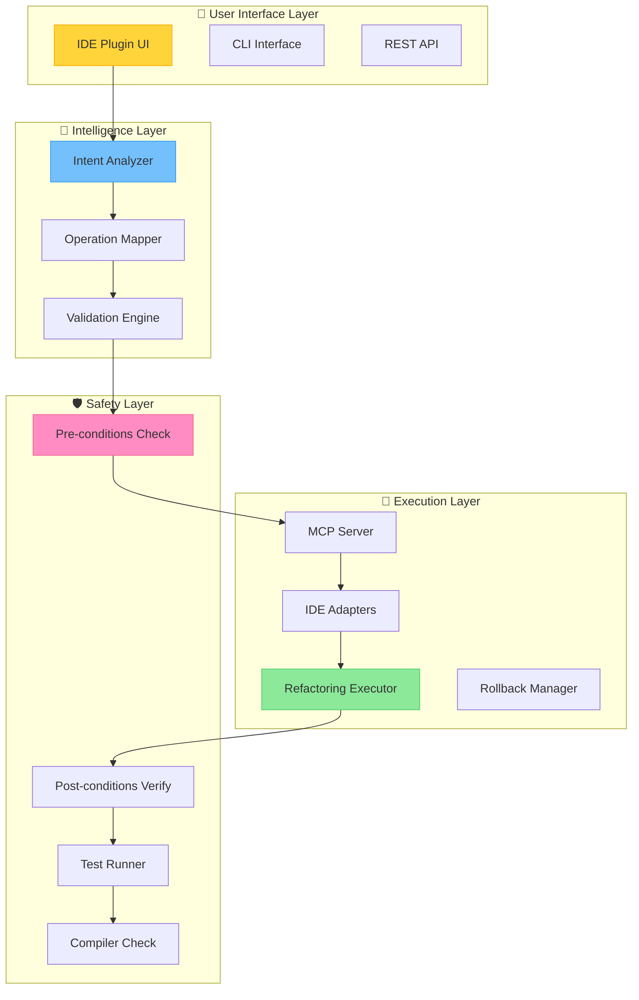


### RefactorAI: Intelligence Meets Precision

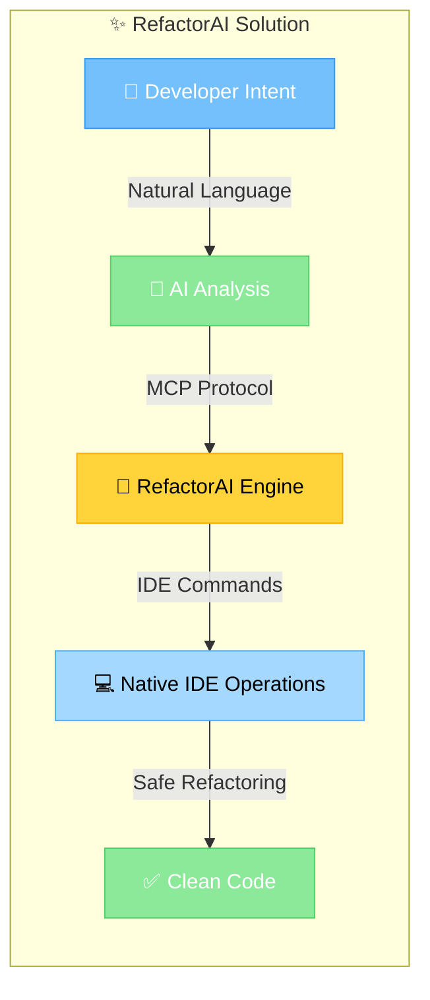

### Core Innovation

**RefactorAI** acts as an intelligent bridge between AI language models and IDE refactoring engines:

1. **🧠 Understands Intent**: AI interprets what you want to achieve
2. **🎯 Maps to Operations**: Translates intent to specific IDE refactoring commands
3. **⚡ Executes Safely**: Uses native IDE operations with full semantic awareness
4. **✅ Guarantees Consistency**: All references updated, no broken code

## 🎯 Key Features

### Intelligent Refactoring Operations

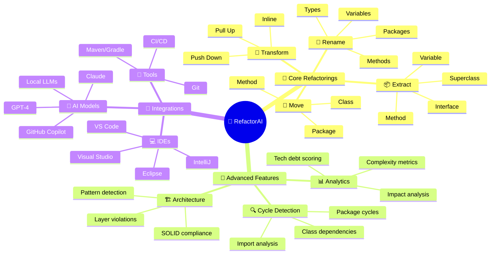

### Supported Refactoring Operations

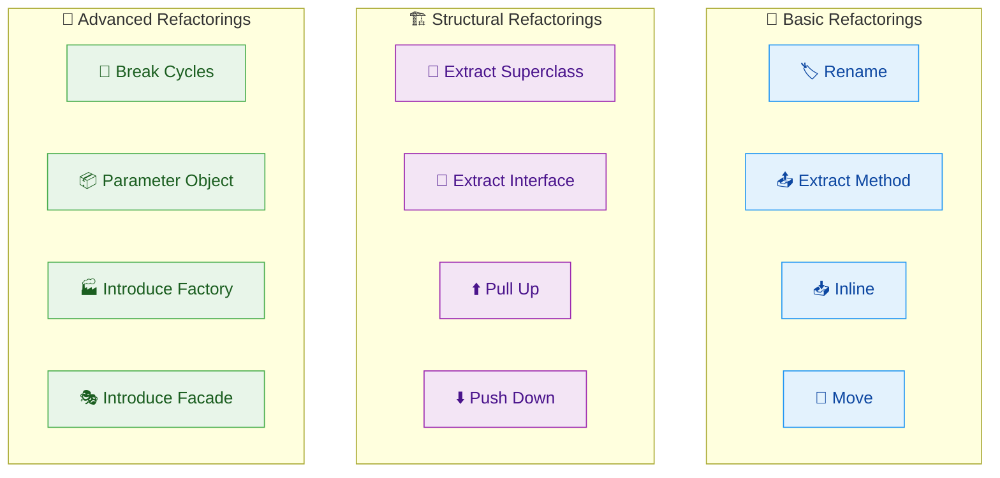

## 🏗️ Architecture

### System Components

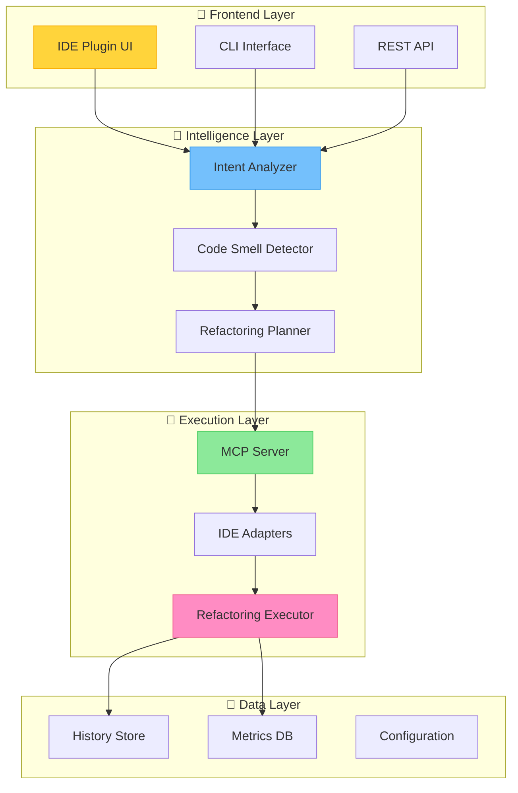


## 📊 Refactoring Operations

### Operation Categories & Capabilities

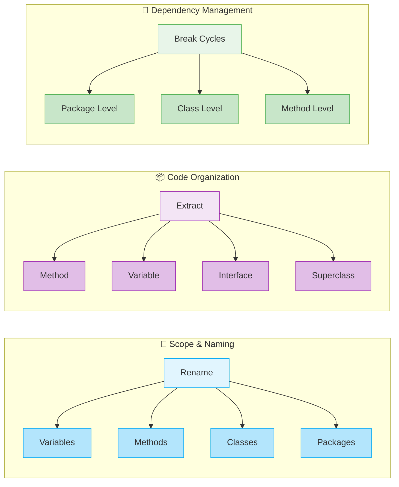

### Complexity Reduction Strategies

| Refactoring | Before Complexity | After Complexity | Impact |
|-------------|------------------|------------------|---------|
| 📤 **Extract Method** | CC: 15 | CC: 3 × 5 | -67% complexity |
| 🏗️ **Extract Class** | LOC: 500 | LOC: 200 + 150 + 150 | Better cohesion |
| 📦 **Parameter Object** | Params: 8 | Params: 2 | -75% parameters |
| 🔄 **Break Cycle** | Circular: Yes | Circular: No | 100% improvement |
| 🎯 **Move Method** | Feature Envy: High | Feature Envy: None | Proper encapsulation |

## 🔌 IDE Support

### Feature Matrix

| Feature | Eclipse | IntelliJ | VS Code | Visual Studio |
|---------|---------|----------|---------|---------------|
| **Basic Refactorings** | ✅ | ✅ | ✅ | ✅ |
| **AI Integration** | ✅ | ✅ | ✅ | ✅ |

✅ Full Support | 🚧 In Development | ❌ Not Planned

## 💼 Use Cases

### 1. Breaking Circular Dependencies

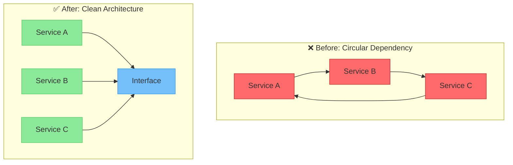

**Command**: "Break the circular dependency between these services"

**RefactorAI Actions**:
1. Detects cycle using graph analysis
2. Suggests Extract Interface refactoring
3. Creates common interface
4. Updates all implementations
5. Verifies no cycles remain

### 2. Legacy Code Modernization

```java
// Before: 500-line method with 15 parameters
public void processOrder(String id, String customer, String product, 
                        int quantity, double price, String address, 
                        String city, String zip, String country, 
                        boolean express, double discount, String coupon,
                        String payment, String card, Date delivery) {
    // 500 lines of spaghetti code...
}

// After: Clean, testable code
public void processOrder(OrderRequest request) {
    Order order = createOrder(request);
    validateOrder(order);
    applyDiscounts(order);
    processPayment(order);
    scheduleDelivery(order);
}
```

### 3. Microservice Extraction

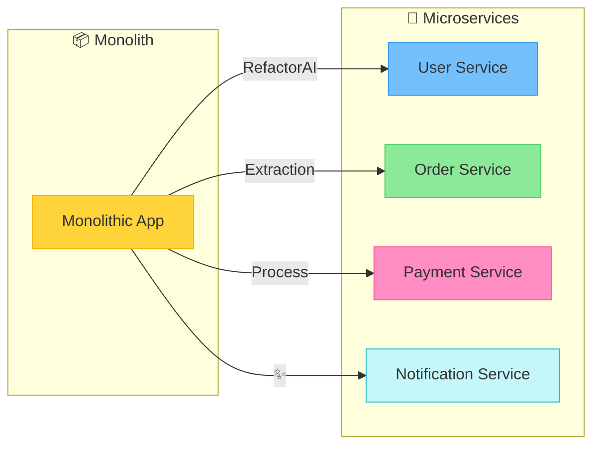

## 📄 License

MIT License - see [LICENSE](LICENSE) file for details.

---

<div align="center">

**🌟 Star us on GitHub to support the project!**

</div>
